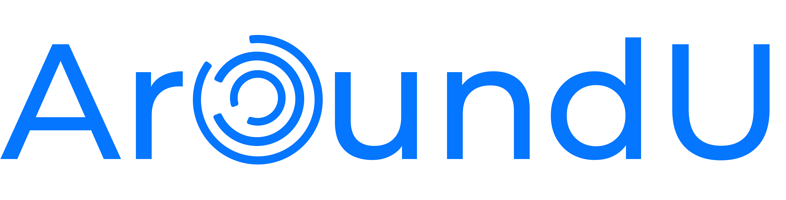

  

# AroundU - Connecting Skilled Workers with Jobs

AroundU is an innovative platform that bridges the gap between skilled workers and clients in need of physical labor. By leveraging modern technology, we aim to revolutionize the way individuals find employment and get their tasks done.

---

## Images

Here are some screenshots of the AroundU app:

<!-- Add more screenshots if needed -->

---

## Video

For a demonstration of the AroundU app, watch the video [here](https://drive.google.com/file/d/1US8IUj9P0P1ld87GRXxpqz468khNenD3/view).

---

## Table of Contents

- [Introduction](#introduction)
- [Key Features](#key-features)
- [Benefits](#benefits)
- [Technology Stack](#technology-stack)
- [Contributions](#contributions)
- [How to Contribute](#how-to-contribute)
- [Getting Started](#getting-started)
- [Contact](#contact)

---

## Introduction

In today's digital age, finding skilled labor for urgent physical work is a significant challenge. AroundU aims to address this issue by providing an online platform similar to freelancing sites, connecting clients with skilled workers for a variety of physical jobs. Workers can register, create profiles, and showcase their expertise, enabling clients to find the right individuals for their projects.

---

## Key Features

1. **Job Negotiation**: Workers and clients can negotiate job terms directly within the app using a chat feature, streamlining the agreement process.
   
2. **Real-time Worker Location**: Clients can track the real-time location of their approved workers using the integrated Google Maps SDK, enhancing transparency and communication.

---

## Benefits

- **Expanded Job Market**: Remote location workers can easily find employment opportunities in new cities, widening their job prospects.
  
- **Efficient Service Access**: Both clients and workers benefit from streamlined service access, making it easier to find the right professionals for various tasks such as maintenance and repairs.

---

## Technology Stack

- **Frontend**: Flutter
- **Backend**: Django, NodeJS
- **Database**: MongoDB
- **Maps Integration**: Google Maps SDK
- **Testing and Development Tools**: Postman, GIT

---

## Contributions

- **Frontend Development**: The frontend was developed using Flutter, focusing on creating an intuitive user interface and seamless interactions.
  
- **Backend Development**: Worked on advanced backend functionalities using Django and NodeJS to ensure smooth data management and enhance user experiences.

---

## How to Contribute

We welcome contributions from the community! If you'd like to contribute to AroundU, please follow these steps:

1. Fork the repository.
2. Clone the forked repository to your local machine.
3. Create a new branch for your feature or fix: `git checkout -b feature/your-feature-name`.
4. Make your changes and commit them: `git commit -m "Your detailed description of the changes."`.
5. Push to the branch: `git push origin feature/your-feature-name`.
6. Open a pull request on the main repository.

---

## Getting Started

To get started with the AroundU project and set up a development environment, follow the steps outlined in the [Getting Started guide](docs/GETTING_STARTED.md).

---

## Contact

For inquiries and support, please reach out to the project maintainers:

- [Aadarsh Pandey](mailto:aadarsh2012014@akgec.ac.in)
- [Harsh Tripathi](mailto:harsh2010113@akgec.ac.in)

Feel free to visit our platform and explore the opportunities to connect skilled workers with clients. Together, let's make a meaningful impact on employment and economic growth! 🌟
